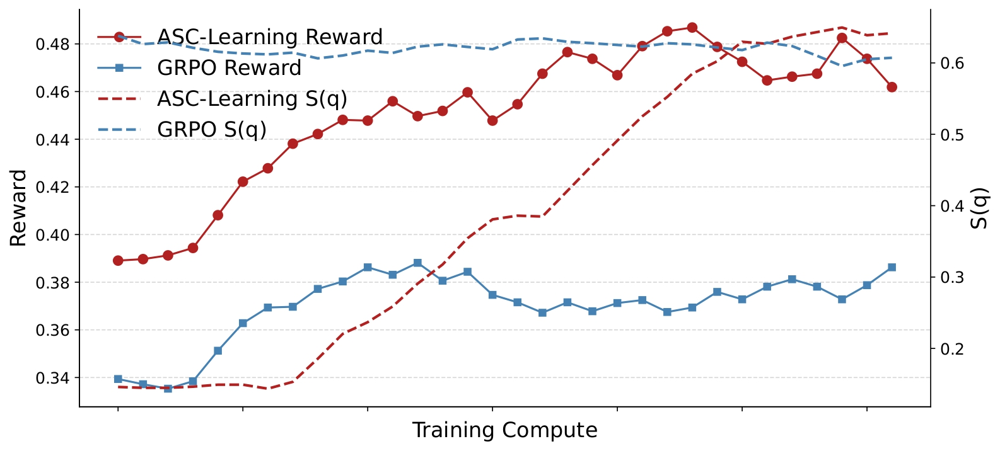
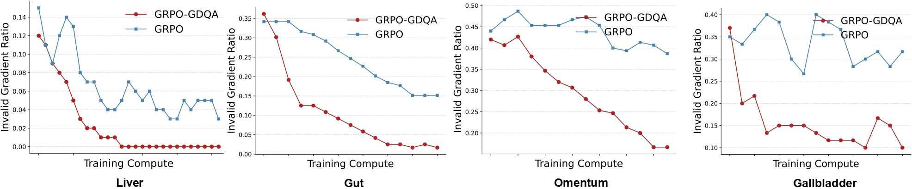

# Anatomy-R1

## 📝 Overview
Anatomy-R1 proposes two novel methods—Anatomical Similarity Curriculum Learning and Group Diversity Question Augmentation—that significantly enhance the medical reasoning abilities of multimodal large language models in clinical anatomical imaging tasks.

## 📈 Training Curves

<figure>
  
  <figcaption><b>Figure 1:</b> The reward and S(q) curves of the Qwen-2.5-VL-7B during training on the SGG-VQA dataset.</figcaption>
</figure>

<figure>
  
  <figcaption><b>Figure 2:</b> Comparison of invalid gradient ratios between GRPO-GDQA and GRPO across training steps using Qwen-2.5-VL-7B on the SGG-VQA dataset.</figcaption>
</figure>

## ⚒️ Requirements

- **ms-swift** framework, version **3.3.0.dev0** must be installed before running this project.  
  Please refer to the [ms-swift documentation](https://github.com/modelscope/swift) for installation instructions.
  

## ✔️ Testing Different Methods

To test different methods, you can find a variety of test scripts in the `examples/train/grpo/` directory:

```bash
ls ms-swift-main/examples/train/grpo/
```

Each script corresponds to a different experimental method.  
**Note:**  If you want to test the **GPG method**, you must replace the default `trainer` file in ms-swift with the 'grpo_trainer.py'. Please ensure you use the correct trainer file before running GPG-related experiments.

